<script setup>

const createUnicorn = () => {
  const unicornCount = 10; // Nombre de licornes par rafale
  for (let i = 0; i < unicornCount; i++) {
    setTimeout(() => spawnUnicorn(), i * 100); // Décalage pour l'effet rafale
  }
};

const spawnUnicorn = () => {
  const unicorn = document.createElement("div");
  unicorn.innerHTML = "🦄";
  unicorn.style.position = "fixed";
  unicorn.style.left = Math.random() * window.innerWidth + "px";
  unicorn.style.top = window.innerHeight + "px"; // Commence en bas de l'écran
  unicorn.style.fontSize = "3rem";
  unicorn.style.opacity = "1";
  unicorn.style.transition = "transform 3s ease-out, opacity 3s";

  document.body.appendChild(unicorn);

  setTimeout(() => {
    unicorn.style.transform = `translateY(-${window.innerHeight}px) rotate(${Math.random() * 720}deg)`;
    unicorn.style.opacity = "0";
    setTimeout(() => unicorn.remove(), 3000);
  }, 50);
};

// Détecter une touche (ex: "U" pour Unicorn)
document.addEventListener("keydown", (event) => {
  if (event.key === "u") {
    createUnicorn();
  }
});

import confetti from 'canvas-confetti';

const launchConfetti = () => {
  confetti({
    particleCount: 100,
    spread: 160
  });
};

// Détecter une touche (ex: "C" pour Confetti)
document.addEventListener("keydown", (event) => {
  if (event.key === "c") {
    launchConfetti();
  }
});


</script>


# All about "single cell" transcriptomics

Laurie Tonon

17/02/2025

---
transition: fade-out
---
# What we'll talk about

1. Techologies refresh
    - What are the technologies available and their specificities
2. Single cell analysis workflow
    - How do we analyse it
3. Focus on spatial transcriptomics analyses
    - Whate are the analyses specific to spatial data
4. Xenium 5K and scRNAseq comparison
    - Can we replace the latter by the former?


	

---
class: 'grid text-center align-self-center 
---

# Single cell transcriptomics technologies


---

# Single cell sequencing

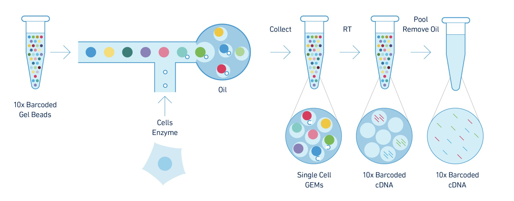


---


# Visium

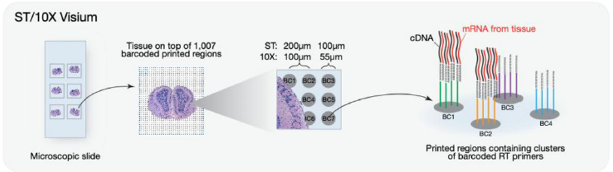

---


# Xenium

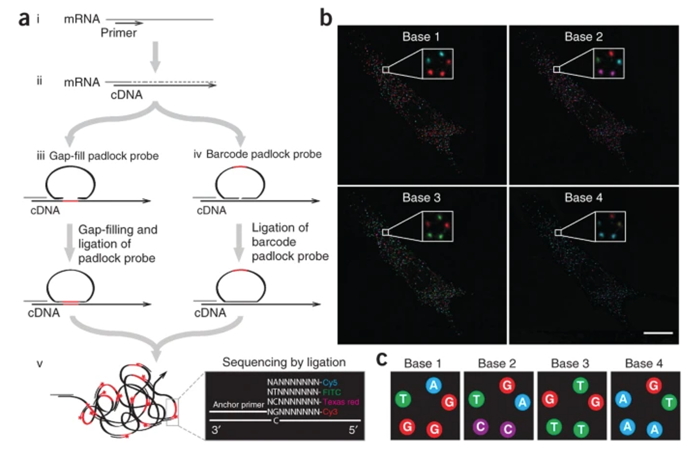


---
layout: text-image
media: https://laurie-tonon.github.io/pres_team_022025/images/10x_technos.png
---

# 3 main technologies

<Transform :scale="0.8">
<v-clicks depth="1">

* scRNAseq
  * Fresh, frozen of FFPE (via nuclei)
  * Whole transcriptome
  * Few thousands of cells
  * single cell resolution
* Visium
  * Frozen or FFPE
  * Whole transcriptome if frozen, probes if FFPE
  * Not a single cell resolution
  * around 5000 spots
* Xenium
  * Frozen or FFPE
  * probes panel
  * sub cellular resolution
  * Few hundreds of thousands of cells
</v-clicks>
</Transform>

---
transition: fade-out
---

# Outputs

* An expression matrix


<div style="clear: left;"></div>

<br>

* For spatial technologies: coordinates of each spot or transcript on the slide

---
class: 'grid text-center align-self-center 
---

# Analyses workflow

---


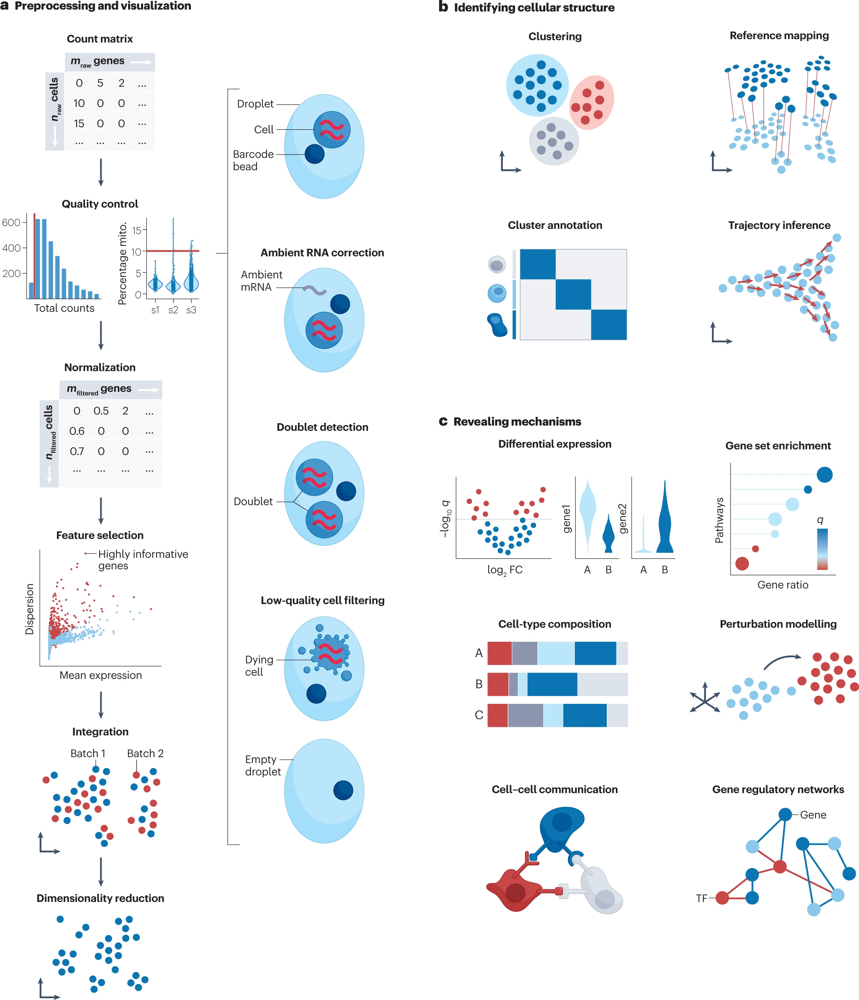

<Transform :scale="0.3">
Heumos et al, nature review genetics
</Transform>


---
layout: text-image
media: https://laurie-tonon.github.io/pres_team_022025/images/preproc.png
reverse: true
class: custom-slide
---
<style>
  .custom-slide img {
    max-width: 52% !important; /* Réduit la taille de l’image */
    max-height: 80vh !important; /* Ne dépasse pas la hauteur de la slide */
  }
</style>

# Preprocessing

* remove non informatives cells
* Normalise data
* Identify biological information


---
layout: text-image
media: https://laurie-tonon.github.io/pres_team_022025/images/cell_struct.png
reverse: true

---

# Cell identification


* Cell types and sub-types identification
  * Clustering
  * Reference mapping
* Trajectories inference

---
layout: text-image
media: https://laurie-tonon.github.io/pres_team_022025/images/cell_mecanisms.png
reverse: true
transition: fade-out
---


# Post processing

* Compare conditions
* Predict cell-cell communication or gene regulation processes
* ...

---
class: 'grid text-center align-self-center 
---

# Focus on spatial transcriptomics analyses

---
layout: center
---

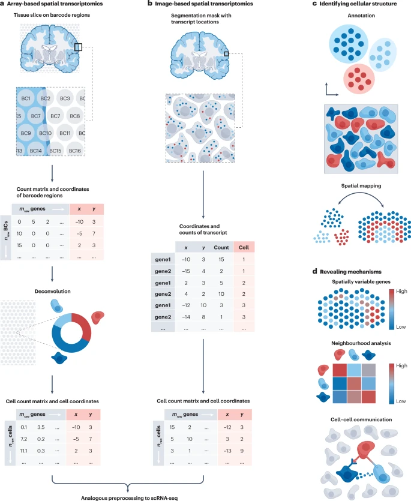

<Transform :scale="0.3">
Heumos et al, nature review genetics
</Transform>

---
transition: fade-out
---

# Xenium specificities

* Only genes panels:
  * 11 available from 10x
  * around 300 or 400 genes, and one 5K
  * added custom or full custom possible

* Difficulty of cell segmentation

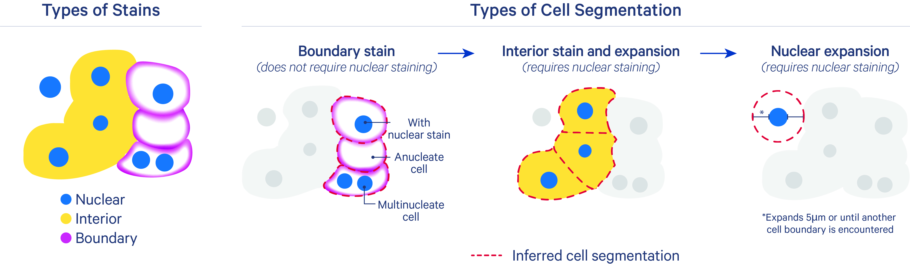

---
class: 'grid text-center align-self-center 
---

# Xenium 5K and scRNAseq comparison

---
layout: center
---

# Is it possible to use Xenium as a single cell technology?

---

# Method

* Public dataset of paired samples of human ovary cancer
* Pre-processing 
* Projected annotation
* Compare some stats
* Other analysis feasibility


---
layout: text-image
media: https://laurie-tonon.github.io/pres_team_022025/images/xenium_ov.png
---

# Public dataset of paired samples of human ovary cancer

* Xenium FFPE
* Cells annotated by 10x

[https://www.10xgenomics.com/datasets/xenium-prime-ffpe-human-ovarian-cancer](https://www.10xgenomics.com/datasets/xenium-prime-ffpe-human-ovarian-cancer)

---
layout: center
---

# Pre-processing

---
layout: two-cols
---

# snRNAseq 

```python {1-2|4-6|8-10|12|14-16|all}
adata = sc.read_10x_h5('filtered_feature_bc_matrix.h5')
adata.var_names_make_unique()

adata = adata[adata.obs.pct_counts_mt < 10]
adata = adata[adata.obs.n_genes_by_counts < 5000]
adata = adata[adata.obs.total_counts < 10000]

adata.layers['count']=adata.X.copy()
sc.pp.normalize_total(adata)
sc.pp.log1p(adata)

sc.pp.highly_variable_genes(adata, n_top_genes=2000)

sc.tl.pca(adata)
sc.pp.neighbors(adata, n_neighbors=40,n_pcs=40)
sc.tl.umap(adata, n_components=3)
```
::right::

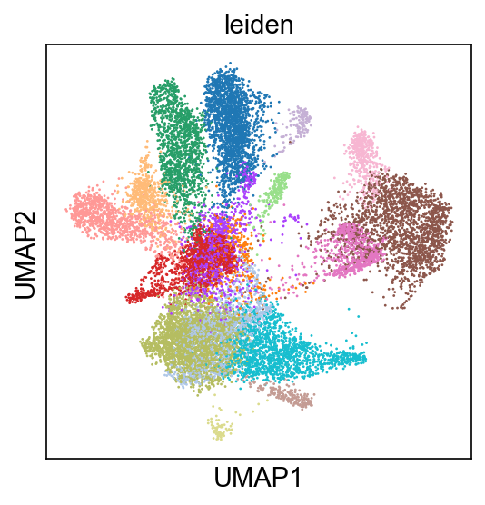{v-click}

---

# snRNAseq 

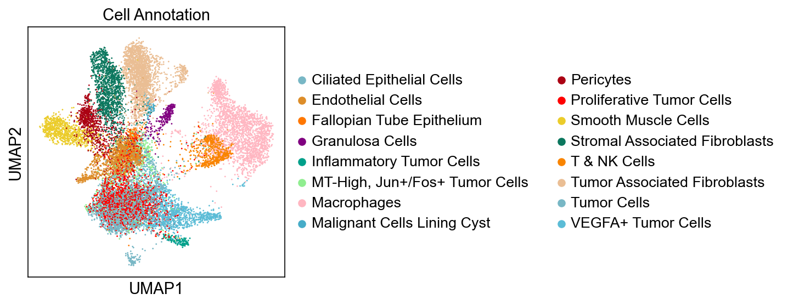

---
layout: two-cols
---

# xenium 


<div style="font-size: 0.8rem;">
  
```python {1-5|6-9|11-13|15|17-19|all}
adata = format_xenium_adata_mid_2023(path = xenium_data/",
  tag="xov",
  output_path=".",
  use_parquet=True,
  get_transcripts=False)
adata = preprocess_transcriptomic_data(only_nuclear=False,
  min_counts=5,
  min_genes=5,
  adata_object=adata)

adata.layers['count']=adata.X.copy()
sc.pp.normalize_total(adata)
sc.pp.log1p(adata)

sc.pp.highly_variable_genes(adata, n_top_genes=5000)

sc.tl.pca(adata)
sc.pp.neighbors(adata, n_neighbors=40,n_pcs=30)
sc.tl.umap(adata, n_components=3)
```
</div>
::right::

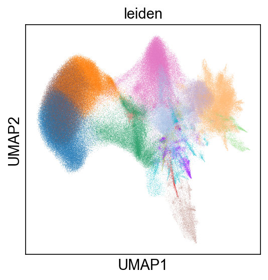{v-click}

---

# xenium 

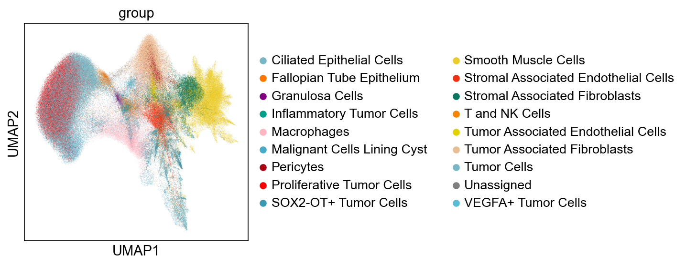

---
layout: center
---

# Compare some stats

---
layout: two-cols
---

# Information per cell


<Transform :scale="0.8">

|                         | snRNAseq | Xenium 5K | scRNAseq 5K |
|-------------------------|----------|-----------|-------------|
|Number of detected cells | 15,566   | 404,335   | 16,566      |
|Median transcripts/cells | 1075     | 196       | 318         |
|Median genes/ cells      | 822      | 151       | 245         |

</Transform>

::right::

<br><br><br>
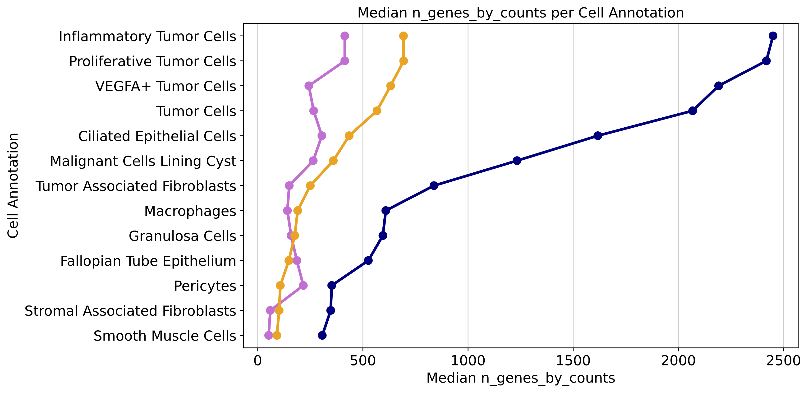

---


# Xenium figures highly correlated to sample

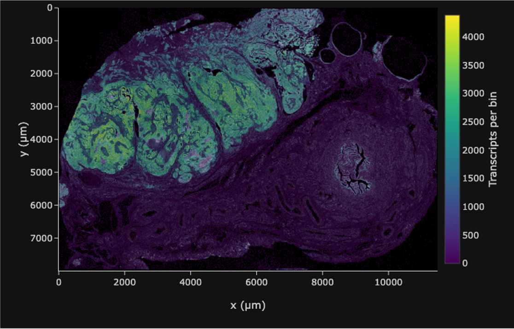

---
layout: text-image
media: https://laurie-tonon.github.io/pres_team_022025/images/score_macro_proj_xenium.png
---

# Marker genes comparison


* Clustering of xenium data
* Apply signature of snRNAseq clusters
* Shown dispersion of signal
=> not enough resolution to reproduce signature


---
layout: text-image
media: https://laurie-tonon.github.io/pres_team_022025/images/score_macro_proj_snrna.png
---

# Marker genes comparison


* Clustering of snRNAseq data
* Apply signature of xenium clusters
* Much better

---
layout: center
---

# Other analyses


---

# Regulons analysis with xenium 5K?

* Compare collectri database (consensus of several tools and db) with 5K gene list

<br><br>
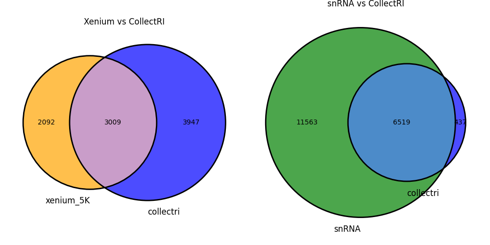

---

# Ligand-Receptor analysis with xenium 5K?

* Compare LIANA database with 5K gene list

<br><br>
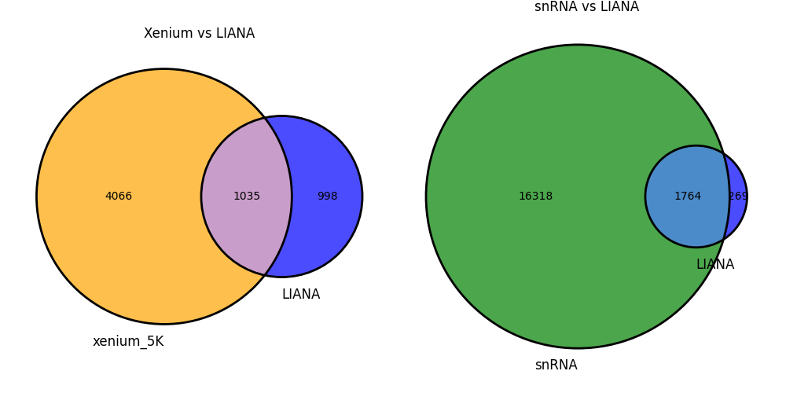

---
class: 'grid text-center align-self-center 
---

# Xenium 5K is not a discovery tool

---

# Conclusion

- Several useful technologies
- Still some development and exploration to do on Xenium
- Needed to compare and select the best analyses strategies

<br>

<Transform :scale="2">
Come to the next pgtèque! 
</Transform>


---
class: 'grid text-center align-self-center 
---

# Thanks


